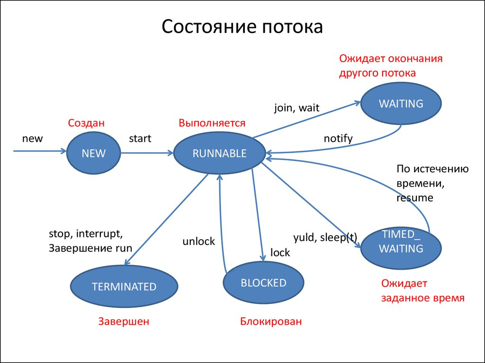

## 3.1.1 Thread
### 3.1.1.1 Threads
Многопоточность/параллелизм - способность ОС выполнять задачи параллельно при условии наличия нескольких процессоров/ядер на компьютере. Чем их больше, тем больше задач может выполняться одновременно.

Многозадачность - несколько задач выполняются попеременно на одном ядре CPU. Это достигается за счёт быстрого переключения между задачами, на которые планировщик выделяет кванты времени (5-100ms).<br>

Процесс - изолированный экземпляр запущенной программы (задача), имеющий свои ресурсы. Процессы не могут обмениваться данными между собой, т.к. это независимые друг от друга элементы.<br>
Нить/поток - абстракция над процессом / "подпроцесс". Потоки делят между собой ресурсы процесса и обмениваются данными.

### 3.1.1.2 Создание и запуск нити
Для создания потока используется класс java.lang.Thread <br>

Thread#currentThread() - статический метод, получающий экземпляр текущего потока выполнения. <br>
Thread#currentThread()#getName() - получение имени текущего потока выполнения. <br>
Thread#start() - указание для JVM о том, что операторы, описанные в конструкторе Thread(Runnable run) нужно выполнить в отдельном потоке. <br>
Runnable - функциональный интерфейс с методом run, внутренние операторы которого будут выполнены в многопоточной среде.

Пример с созданием через lambda:
```java
Thread t = new Thread(
        () -> System.out.println(Thread.currentThread().getName())
);
```

Пример с созданием через анонимный класс:
```java
Thread t = new Thread(
        new Runnable() {
            @Override
            public void run() {
                System.out.println(Thread.currentThread().getName())
            }
        }
);
```

## 3.1.1.3 Состояние нити
Нити имеют следующие состояния:
- NEW: Поток создан, но ещё не запущен. Возникает сразу после создания объекта Thread, но до вызова метода start(). В этом состоянии поток не готов к выполнению и не потребляет системные ресурсы. <br>
Пример:
```java
Thread thread = new Thread(() -> System.out.println("Hello!"));
System.out.println(thread.getState()); // NEW
```

- RUNNABLE: поток запущен, но не обязательно выполняется в данный момент. Включает в себя два подсостояния: Ready (ждёт CPU от планировщика) и Running (выполняется на CPU). <br>
Пример:
```java
thread.start();
System.out.println(thread.getState()); // RUNNABLE
```
- BLOCKED: Поток переходит в это состояние, если он пытается войти в синхронизированный блок или метод, доступ к которому в данный момент удерживается другим потоком. Как только монитор освобождается, поток возвращается в состояние RUNNABLE. <br>
Пример:
```java
Object lock = new Object();

Thread thread1 = new Thread(() -> {
    synchronized (lock) {
        while (true); // Бесконечный цикл (удерживает lock)
    }
});

Thread thread2 = new Thread(() -> {
    synchronized (lock) { // Блокируется, пока thread1 не отпустит lock
        System.out.println("Захватил lock!");
    }
});

thread1.start();
thread2.start();
Thread.sleep(100);
System.out.println(thread2.getState()); // BLOCKED
```

- WAITING: Поток находится в состоянии ожидания без указания времени, пока другой поток не разбудит его. Это происходит при вызове методов Object.wait(), Thread.join() без таймаута или LockSupport.park(). Поток остаётся в этом состоянии, пока не получит уведомление или пока другой поток не завершится (в случае join()). <br>
Пример:
```java
Thread thread1 = new Thread(() -> {
    synchronized (lock) {
        try {
            lock.wait(); // Переходит в WAITING
        } catch (InterruptedException e) {}
    }
});

thread1.start();
Thread.sleep(100);
System.out.println(thread1.getState()); // WAITING
```

- TIMED_WAITING: Похожее на состояние WAITING, но с указанным временем ожидания. Поток переходит в это состояние при вызове методов sleep(), wait() или join() с указанием таймаута. По истечении времени ожидания поток автоматически возвращается в состояние RUNNABLE.<br>
Пример:
```java
Thread thread = new Thread(() -> {
    try {
        Thread.sleep(1000); // TIMED_WAITING
    } catch (InterruptedException e) {}
});

thread.start();
Thread.sleep(100);
System.out.println(thread.getState()); // TIMED_WAITING
```

- TERMINATED: Поток переходит в это состояние, когда метод run() завершает своё выполнение либо из-за нормального завершения, либо из-за неперехваченного исключения. В этом состоянии поток больше не может быть перезапущен.<br>
Пример:
```java
Thread thread = new Thread(() -> System.out.println("Done!"));
thread.start();
thread.join(); // Ждем завершения
System.out.println(thread.getState()); // TERMINATED
```



### 3.1.1.4 Режим ожидания
Для приостановления нити используется метод Thread#sleep(milliseconds).<br>
Особенности:
- этот метод переводит поток в состояние TIMED_WAITING;
- метод может выбросить исключение InterruptedException - это связано с тем, что поток могут прервать и это потребует предусмотреть дальнейшие действия. <br>

Символ \r указывает возврат каретки в начало строки (это позволяет обновить строку через промежутки времени).

### 3.1.1.5 Прерывание нити
Нить можно приостановить / прервать. В Java есть методы, связанные с этой операцией:
- thread#interrupt() - рекомендация JVM о том, чтобы нить завершила работу. Этот метод ТОЛЬКО выставляет флаг и не совершает никаких дополнительных действий по приостановке потока.
- Thread.currentThread().isInterrupted() - проверка состояния флага и ничего более
- thread#interrupted() - сброс статуса прерывания после проверки флага


### 3.1.1.6 Прерывание блокированной нити
Метод Thread#interrupt(), вызванный в методах sleep, join, wait, не выставляет прерывания, если нить в режиме ожидания, сна или заблокирована другим схожим вызовом.<br>
В таких случаях, эти методы выбрасывают исключение InterruptedException. Соответственно, в блоке catch НЕОБХОДИМО дополнить проставлять флаг прерывания Thread#interrupt.<br>
InterruptedException нужно для прерывания потока, выполняющего блокирующий вызов (sleep, join, wait). Это исключения является единственным способом прерывания метода без возврата какого-либо значения, не нарушая его контракт.

Пример с вечным циклом: [ThreadStop.java](src%2Fmain%2Fjava%2Fru%2Fjob4j%2Fconcurrent%2Ftasks%2Fthread_interrupt_blocked%2FThreadStop.java)
Исправляется вызовом Thread#currentThread()#interrupt() - при использовании блокирующих методов вызов метода interrupt() является необходимым.

### 3.1.1.7 Приоритеты нитей и нити-демоны
У нитей есть приоритеты (значения от 1 до 10 в порядке возрастания важности). Приоритет используется планировщиком нитей для того,
чтобы определять какой нити в данный момент разрешать работать. Согласно планированию нитей, более приоритетные должны исполняться первыми, а остальные
по уменьшению приоритетов. При одинаковом приоритете нити работают по кругу.

В реальности это не совсем так, ибо на выделение ресурсов на работу нити влияет множество факторов (реализация многопоточности в ОС как минимум), поэтому предугадать работу многопоточного приложения,
опираясь только на приоритеты потоков - ошибочно.

Особенности:
- для установки приоритета потоку используется метод thread#setPriority(int level);
- для получения приоритета используется метод getPriority()

**Потоки-демоны**
Существует два типа потоков: пользовательские и демоны:
- пользовательские являются более приоритетными;
- JVM завершает работу пользовательского потока по завершению его задачи;
- при наличии пользовательских потоков после завершения метода main - JVM даст им выполниться;
- каждый тип потока порождает только такой же дочерний тип потока;
- чтобы сделать поток демоном, используется метод setDaemon(true) и это нужно сделать перед запуском потока (перед #start());
- для проверки того, что поток - демон, используется метод #isDaemon();
- потоки демоны - низкоприоритетные, выполняют фоновую/сервисную работу (сборка мусора, очистка кэша, освобождение памяти и т.д.);
- при завершении работы JVM, работа демон-потоков обрывается;
- крайне не рекомендуется использовать потоки-демоны для I/O задач.

### 3.1.1.9 ThreadLocal
ThreadLocal - это переменная, копия которой доступна локально внутри каждой потока. Особенности:
- отличается от своих обычных аналогов-переменных тем, что каждый поток, обращающийся к ThreadLocal, будет иметь свою независимо инициализированную копию переменной (данные, записанные в эту переменную в одной потоке, не будут видны в других);
- применяется:
  - при хранении информации передаваемой по цепочке методов (сессия пользователя);
  - при реализации счетчика для потоков;
  - при кэшировании непотокобезопасных ресурсов (многопоточный потокобезопасный кэш - дорогая задача из-за синхронизации при каждом обращении к кэшу)
- изолирует только ссылки на объекты. Если в разных потоках записать в эту переменную один и тот же объект, то при работе с ним проявятся все проблемы многопоточности

## 3.1.2 Общие ресурсы
### 3.1.2.0 Что такое атомарность?
Атомарность - это свойство группы операций, которые выполняются неразрывно, как логическая единица.<br>
Операция инкремента счётчика не атомарна. Определить не атомарные операции просто. Все операции, где данные зависят от 
начального состояния не атомарны. Эти операции можно описать через процесс "проверить и выполнить".

Пример: [CountShareMain.java](src%2Fmain%2Fjava%2Fru%2Fjob4j%2Fcommon%2Ftasks%2Fatomicity%2FCountShareMain.java)
Изменение переменной посредством неатомарной операцией приводит к тому, что значение не соответствует ожидаемому.

### 3.1.2.1 Синхронизация общих ресурсов
Синхронизация блокирует одновременный доступ к методам. <br>
Одним из способов это сделать - использовать ключевое слово synchronized в сигнатуре метода после модификатора доступа.
```java
public synchronized void increment() {
    value++;
}
```

В таком случае, вызов СИНХРОНИЗИРОВАННОГО метода increment() двумя и более потоками приводит к тому, что
только одна нить работает с этим методом, а остальные уходят в режим блокировки до окончания работы нити, захватившей этот метод.
По сути - синхронизация делает параллельную программу последовательной.

**Критическая секция** <br>
Код в блоке или методе synchronized называется критической секцией - областью памяти, с которой одновременно
может работать только один поток. JVM использует мониторы для регулирования эксклюзивного доступа. Как
только поток заходит в synchronized МЕТОД какого-либо класса, другой поток не сможет зайти НИ В ОДИН synchronized
метод этого класса до тех пор, пока первый поток не освободит занятый им метод.

Особенности:
- в Java есть два механизма указать монитор: явный и неявный;
- synchronized в примере выше - неявный монитор;
- у нестатического synchronized метода монитором является объект этого класса;
- у статического synchronized метода монитором является сам класс.

В примере ниже:
- для lockOfInstance монитор - это объект ShowRoomLock
- для lockOfClass монитор - это сам класс ShowRoomLock
```java
public class ShowRoomLock {    
    public synchronized void lockOfInstance() {/*some logic*/}
    public static synchronized void lockOfClass() {/*some logic*/}
}
```

Ещё один пример ниже с ЯВНЫМИ мониторами (нужно использовать БЛОК synchronized):
- для lockOfInstance монитор - это объект ShowRoomLock
- для lockOfClass монитор - сам класс ShowRoomLock

```java
public class ShowRoomLock {    
    public void lockOfInstance() { 
         synchronized (this) {/*some logic*/}    
    }

    public static void lockOfClass() {
        synchronized (ShowRoomLock.class) {/*some logic*/}
    }
}
```

### 3.1.2.2 Модель памяти Java, volatile

В коде ниже есть риск, что программа будет работать бесконечно.
```java
package ru.job4j;

public class Flag {
    private static boolean flag = true;

    public static void main(String[] args) throws InterruptedException {
        Thread thread = new Thread(() -> {while (flag) {/*does some logic*/}});
        thread.start();
        Thread.sleep(1000); // позволяем некоторое время выполняться коду thread
        flag = false; // сигнал потоку thread остановиться
        thread.join(); // ждём пока thread закончит свою работу
    }
}
```

Причины этого риска заключаются в следующем:
- на уровне JVM потоки main и thread могут читать flag из heap;
- на уровне процессора память организована register -> CPU cache -> RAM;
- может произойти так, что main поток запишет значение flag в кэш процессора, а thread будет читать переменную из регистра.

Такая ситуация называется проблемой видимости (share visibility problem).

Как решить?<br>
1. Использовать синхронизацию - работать с флагом через эксклюзивный доступ;
2. Использовать модификатор volatile

Первый способ в данном случае избыточен, т.к. flag не привязан к предыдущему состоянию.<br>
Второй способ более уместен, т.к. он рекомендован к использованию в случаях, где обновление общего ресурса не зависит от его состояния.<br>
Для операции инкрементации volatile использовать нельзя.

**volatile**
Ключевое слово volatile используется для полей класса и означает, что операции R/W переменной будет происходить только из RAМ памяти процессора.<br>
Если добавить это слово к объявлению переменной flag, то, взглянув на ассемблерный код программы, можно увидеть, что обращение к полю flag обёрнуто в критическую секцию для обеспечения синхронизации ресурсов.

Особенности:
- согласно спецификации, Java разрешает reordering операций без volatile над переменной; (1)
- volatile гарантирует, что запись в переменную произойдёт до её чтения в другом потоке

1* - это достигается за счёт установки барьеров:
- StoreStore Barrier – гарантирует, что все операции записи перед записью volatile переменной завершатся до неё (в случае DCL - конструктор отработает до присваивания instance);
- StoreLoad Barrier – гарантирует, что результат записи volatile станет видна всем потокам сразу.
 
- Ссылки на особенность реординга:
1. JSR спецификация: https://www.cs.umd.edu/~pugh/java/memoryModel/jsr-133-faq.html#dcl
2. Oracle manual: https://docs.oracle.com/javase/tutorial/essential/concurrency/atomic.html
3. Хабр пост: https://habr.com/ru/articles/685518/

## 3.1.3 Синхронизация ресурсов

### 3.1.3.0 Монитор, Мьютекс, Критическая секция
**Критическая секция** - код внутри метода, защищенный от конкурентного доступа, обозначенный 
ключевым словом synchronized. С этой областью памяти одновременно может работать только 
один поток. JVM использует мониторы для регулирования эксклюзивного доступа. Как только 
поток заходит в synchronized метод какого-либо класса, другой поток не сможет зайти 
ни в один из synchronized методов этого класса, пока первый поток не освободит занятый им 
метод. Это позволяет избежать "состояния гонки".

**Состояние гонки (race condition)** - состояние, при котором несколько потоков одновременно 
используют один и тот же ресурс, соревнуются за него, в результате чего получается 
несогласованность данных в программе. 

**Мьютекс (MUTual EXclusion - взаимное исключение)** - простейший тип синхронизатора потоков. 
Мьютекс гарантирует, что с критической секцией может работать одновременно только один поток. 
Мьютекс имеет только 2 состояния - свободен или занят:
- если свободен - занимаем ресурс;
- если занят, то встаем в очередь и ждем освобождения ресурса. 

Каждый объект в Java имеет мьютекс. Это своеобразный флаг, которым управляет JVM 
в процессе выполнения кода. Непосредственного доступа к мьютексу программист не имеет, 
им управляет только JVM. Мьютекс входит в состав монитора, который им управляет. 
При обращении потока к критической секции (объекту), монитор проверяет 
состояние мьютекса, и если он свободен, занимает его и даёт доступ потоку к критической 
секции. После выполнения потоком своей работы, монитор отпускает мьютекс и освобождает 
доступ другим потокам к критической секции. Если на момент попытки доступа потока к 
критической секции (объекту) монитор держит мьютекс, то поток встаёт в ожидание до тех пор, 
пока ресурс не освободится.

Цель мьютекса - исключить возможность состояния гонки (асинхронного изменения данных), 
то есть предотвратить повреждение данных. Если поток получил доступ к объекту, то все 
остальные потоки, которым нужен этот объект, будут вставать в очередь на получение доступа. 
Такая реализация имеет и недостаток - блокировка объектов может привести к взаимной 
блокировке - Deadlock. 

**Deadlock** - ситуация, когда два и более потока бесконечно ждут разблокировки друг друга.

**Монитор**: 
- это высокоуровневый механизм взаимодействия и синхронизации процессов, 
обеспечивающий проверку состояния доступа к критической секции, а также организовывает 
работу с мьютексом. 
- это высокоуровневая абстракция над мьютексом. Через монитор виртуальная машина 
понимает, занят ли сейчас блок кода (объект), к которому обращается нить, или нет.
- объект, по которому проходит синхронизация, но технически монитор - это сам механизм синхронизации.
- управляет мьютексом

**synchronized** блок кода контролируется монитором. При вызове non-static synchronized метода, 
монитор пытается захватить мьютекс объекта, у которого он вызван (this). Если мьютекс 
свободен - монитор его захватывает и даёт доступ нити к критической секции, 
а если нет - встает в очередь ожидания освобождения мьютекса. 
Проверка состояния монитора атомарна (мьютекс занят или свободен). Блокировку посредством 
монитора еще называют monitor lock. После выполнения кода внутри блока, поток 
"выходит из монитора", а монитор освобождает мьютекс, снова разрешая доступ к этому объекту.

Использование synchronized в данных методах эквивалентно, монитором является экземпляр класса.
```java
public synchronized void increment() {
    value++;
}

public void increment() {
    synchronized (this) {
      value++;
    }
  }
```

Простыми словами: мьютекс - это замок. При запросе потоком доступа к критической секции, 
монитор проверяет, открыт ли замок, и если да, то даёт доступ поток к блоку кода, а с помощью
мьютекса "закрывает" замок для остальных потоков, пока первый поток не закончит работу с 
объектом, после чего замок открывается.

### 3.1.3.2 JSIP библиотека
**net.jcip.jcip-annotations** - библиотека, информирующая о проблемах многопоточности, в частности наличия общих ресурсов.

**@ThreadSafe** аннотация сообщает о том, что класс можно использовать в многопоточном режиме и гарантируется корректность его работы.<br>
**@GuardedBy("this")** аннотация выставляется над общим ресурсом, она имеет входящий параметр - он указывает на монитор, 
по которому будет произведена синхронизация.


### 3.1.3.6 Синхронизаторы
Синхронизаторы - это вспомогательные классы для синхронизации потоков, дающие более гибкое 
управление потоками, чем работа с монитором. Синхронизатор - это абстракция над монитором. 
Синхронизаторы находятся в пакете java.util.concurrent, к ним относятся классы Semaphore, 
CyclicBarrier, CountDownLatch, Phaser и Exchanger.

#### Semaphore
Это тип синхронизатора со счетчиком (количеством разрешений для входа). 
При создании объекта Semaphore в конструкторе задается изначальное количество разрешений. 
Запрашивать можно 1 и более разрешений сразу. При запросе нитью разрешения, происходит 
проверка на наличие запрашиваемого количества разрешений на счету семафора. Если такое 
количество есть на счету, нить получает доступ к ресурсу, а со счетчика списывается это 
число разрешений. После того как нить выполнила работу, она возвращает свое разрешение 
обратно в семафор. Возвращаясь к понятию мьютекс - это семафор с одним разрешением.

Рассмотрим простейший пример семафора:
```java
public static void main(String[] args) throws InterruptedException {
  Semaphore semaphore = new Semaphore(0); // семафор на 0 разрешений
  Runnable task = () -> {
    try {
      semaphore.acquire(); // запрос на выполнение работы
      System.out.println("Нить выполнила задачу"); // выполнение работы
      semaphore.release(); // возвращение разрешения в семафор
    } catch (InterruptedException e) {
        e.printStackTrace();
    }
  };

  // запускаем поток, где запрашиваем у семафора разрешение на выполнение работы, 
  // но там 0 разрешений, поэтому засыпаем и ждём когда разрешение появится
  new Thread(task).start();
  
  // ждём 3 сек чтобы отработала следующая за слипом команда релиз(1), 
  // которая увеличит счётчика семафора на 1, что позволит таске выполниться
  Thread.sleep(3000);
  semaphore.release(1);
}
```

Пример из жизни: 
- В прокате велосипедов есть 3 свободных велосипеда. 
- Пришли 2 человека и взяли каждый по велосипеду. 
- Остался только 1 свободный. 
- Пришли ещё 2 человека и просят сразу 2 велосипеда.
- Счётчик = 1, велосипедов на двоих не хватает 
- Ждёте пополнения счётчика до 2
- Забираете велосипеды

Более простой пример в пакете [semaphore](src%2Fmain%2Fjava%2Fru%2Fjob4j%2Fsync%2Ftasks%2Fsynchronizers%2Fsemaphore)

### CountDownLatch
Представляет собой блокировку нитей с обратным отсчетом. При создании объекта CountDownLatch 
в конструктор передается число - счетчик, который при каждом выполнении нитями заданного 
действия, уменьшается на один. Неограниченное число нитей будет ожидать, пока в других 
активных нитях не произойдет достаточное количество действий, чтобы снять блокировку. 
Указание потоку "ждать" дает метод await(), а метод countdown() уменьшает счетчик на 1. 
Как только счетчик = 0, блокировка снимается со всех нитей, ждущих по вызову await(), и 
они смогут продолжать свою работу.

Пример из жизни: В школе занятие по физкультуре. Мальчики бегут туда и обратно до конца 
спортзала, а девочки кидают мяч в баскетбольное кольцо. Условие занятия - мальчики добегают 
до конца спортзала и могут побежать обратно только после того, как девочки 5 раз попадут 
мячом в кольцо. После пятого попадания (счетчик = 0) учитель дает свисток, и мальчики 
могут бежать обратно.

CountDownLatch идеально подходит для событий ожидания.<br> 
Вышеупомянутый пример с комментариями расписан в коде пакета: <br>
[Пример СountDownLatch](src%2Fmain%2Fjava%2Fru%2Fjob4j%2Fsync%2Ftasks%2Fsynchronizers%2Fcountdownlatch)


### CyclicBarrier
Реализует барьерную синхронизацию, где каждый поток остановливается 
в определенном месте и ждёт окончания работы других потоком (шаблон синхронизации Барьер).<br> 
CyclicBarrier схож с CountDownLatch:
- оба синхронизатора позволяют потокам ждать друг друга;
- различие 1 - CyclicBarrier можно использовать многократно, в отличие от CountDownLatch;
- различие 2 - CyclicBarrier позволяет выполнить действие после того, как все потоки собраны<br> 
и ждут. 
- технически: CyclicBarrier считает количество ждущих нитей только по количеству вызовов await() у барьера;
- технически: CountDownLatch считает общее количество вызовов countdown() из разных нитей, после чего освобождаются нити, ждущие на wait()

Процесс происходит так:
- при создании объекта CyclicBarrier в конструктор передается количество потоков, которые 
должны собраться и ждать, а также, при необходимости, передается запланированное действие (task типа Runnable). 
- после накопления указанного количества ждущих потоков, выполняется переданная task;
- блокировка снимается;
- цикл повторяется.

Пример из жизни (описан в пакете [cyclicbarrier](src%2Fmain%2Fjava%2Fru%2Fjob4j%2Fsync%2Ftasks%2Fsynchronizers%2Fcyclicbarrier)): 
- Грузчики разгружают машину с ящиками на склад. 
- Ящик могут поднять только 4 грузчика сразу. 
- Грузчики подходят к ящику и встают у него, ожидая остальных.
- Когда все грузчики в сборе(ждут у барьера), водитель-экспедитор отмечает себе ящик как 
выгруженный (производит запланированное действие);
- после чего дает команду грузчикам выгружать ящик (барьер ломается);
- цикл повторяется.


### Phaser
Отвечает за синхронизацию потоков, представляющих одну или несколько фаз выполнения действия. <br>
Phaser расширяет функциональность CyclicBarrier и реализует шаблон синхронизации Барьер. Принцип работы тот же - сбор ожидающих нитей 
в определенной точке выполнения программы, но есть несколько отличий:
- Каждый цикл сбора нитей - это отдельная фаза. Фазы нумеруются от 0.
- Поведение каждой нити зависит от реализации. При достижении контрольной точки, она может ждать, а может зафиксировать выполнение фазы и продолжать выполнять свою работу дальше.
- Количество участвующих нитей может меняться. Одни нити могут сниматься с участия по той или иной причине (Например, работа окончена), а другие могут подключаться к процессу на разных фазах.
- Phaser не имеет опционального действия как CyclicBarrier.
- Нить должна быть зарегистрирована в Phaser, чтобы принимать участие, в отличие от барьера.

Процесс: 
- создается объект Phaser;
- регистрируются все участники с помощью метода register(), либо в конструкторе передается нужное количество участников;
- каждая нить выполняет свой объем работы, по окончании которой нить вызывает один из 
следующих методов:
  - arrive(). Нить уведомляет о том, что её работа в этой фазе завершена, и возвращает номер 
фазы. При этом нить продолжает свою работу без остановки.
  - arriveAndAwaitAdvance(). Уведомляет, что нить завершила фазу и будет ждать, пока другие 
нити завершат свои фазы. Возвращает номер фазы.
  - arriveAndDeregister(). Уведомляет, что нить завершила фазу и снимается с регистрации. 
Возвращает номер фазы.

Phaser ждет, пока каждая зарегистрированная нить отчитается о достижении окончания фазы, 
после чего Phaser разблокирует все ожидающие нити, и переходит к следующей фазе.

Пример из жизни (описан в пакете [phaser](src%2Fmain%2Fjava%2Fru%2Fjob4j%2Fsync%2Ftasks%2Fsynchronizers%2Fphaser)): упражнения на физкультуре. Один ученик опоздал и начал уже со второго 
упражнения(зарегистрировался). А у другого ученика освобождение от последнего упражнения, 
и он на сегодня закончил занятия. Упражнения здесь - это фазы.


### Exchanger<Т>
Используется для синхронизации обмена данными между двумя потоками в определенной фазе работы потоков. 
Он ожидает до тех пор, пока два отдельных потока не вызовут его метод exchange(). 
После этого происходит обмен данными, предоставленными обоими потоками. 
Важной его особенностью является то, что он не завершится успешно до тех пор, пока не будет
вызван метод exchange() у одного и того же объекта типа Exchanger из двух разных нитей.

Exchanger - это обобщенный класс. Exchanger<Т>. Т - тип обмениваемых данных.

Пример из жизни (упрощенный пример описан в пакете ): Брат едет на другой конец города, где живут ваши родственники. Вы отдали 
брату подарки для родственников и ждете, когда вам придут подарки от них в ответ. Брат 
приехал, обменял подарки и по приезду передал вам. Exchanger может и не передавать данные 
с одной из сторон (null), а просто передать данные одной нити - другой нити.
Exchanger здесь - место, где происходит обмен.


#### Сводная таблица по синхронизаторам в Java
|Синхронизатор| Краткое описание                                                                |Плюсы                                                                 |Минусы                                                                 |Когда использовать?                                                                 |
|--------------|---------------------------------------------------------------------------------|--------------------------------------------------------------------------|-----------------------------------------------------------------------|------------------------------------------------------------------------------------|
|Semaphore |Ограничитель числа потоков для одновременного доступа к ресурсу.                 | - Гибкость (можно задавать любое число разрешений).<br>- Подходит для пулов ресурсов. | - Не гарантирует порядок потоков.<br>- Риск deadlock при неправильном использовании. | Когда нужно ограничить доступ к ресурсу (парковка, подключения к БД, Rate Limiting). |
|CountDownLatch|Позволяет потокам ждать, пока набор операций не завершится (счётчик уменьшается). | - Простота использования.<br>- Однократное срабатывание.                 | - Нельзя переиспользовать после обнуления.                            | Ожидание старта/завершения группы задач (загрузка данных, начало игры).            |
|CyclicBarrier|Точка синхронизации, где потоки ждут друг друга перед переходом к следующему этапу. | - Многоразовый (автоматический сброс).<br>- Поддержка действия после барьера. | - Фиксированное число потоков.                                        | Многоэтапные задачи (обработка данных по фазам, старт раундов в игре).             |
|Phaser    |Барьер с динамическим числом участников и поддержкой многофазности.              | - Можно добавлять/удалять потоки.<br>- Подходит для сложных сценариев.  | - Сложнее в использовании, чем CyclicBarrier.                         | Динамические задачи (игры с подключающимися игроками, многоэтапные вычисления).    |
|Exchanger |Обмен данными между двумя потоками в точке встречи.                              | - Простота обмена объектами.<br>- Полезен для producer-consumer.        | - Работает ТОЛЬКО для 2 потоков.                                      | Когда два потока должны передать друг другу данные (конвейерная обработка).        |
|ReentrantLock|Альтернатива synchronized с расширенными возможностями (таймауты, честность).    | - Гибкость (условные блокировки, tryLock).<br>- Лучшая производительность. | - Требует ручного управления (нужно unlock в finally).               | Когда synchronized недостаточно (например, нужны сложные условия блокировки).    |


#### Аналогии из жизни
- Semaphore — парковка с ограниченными местами.
- CountDownLatch — старт марафона после готовности всех бегунов.
- CyclicBarrier — собрание команды перед каждым этапом проекта.
- Phaser — онлайн-игра, где игроки присоединяются/выбывают между раундами.
- Exchanger — два друга обмениваются подарками.

Ссылки: 
- https://habr.com/ru/post/277669/

## Wait, Notify, NotifyAll
### 0. Управление нитью через wait

Рассмотрим методы notify, notifyAll, wait, yield и их особенности:
- notifyAll - будит все потоки, которые ждали изменения состояния;
- wait - переводит поток в состояние ожидания, если программа дальше не может быть выполнена;
- notify - пробуждает один случайный поток, ожидающий монитора;
- yield - уступает процессорное время, давая шанс выполниться потокам с таким же приоритетом:
  - не гарантирует, что другой поток будет выполняться сразу;
  - не освобождает блокировки.
- wait, notify, notifyAll обязаны быть вызванными в блоке/методе synchronized, иначе будет выброшено IllegalMonitorStateException;
- notify без wait бесполезен, поток не ждёт

#### Блокировки
Блокировка (Lock) - это инструмент для регулирования доступа к ресурсу, с которым работает несколько потоков.
Принцип работы с общим ресурсом:
- поток пытается получить блокировку для ресурса
- если ресурс свободен, поток занимает его
- если ресурс занят, то поток ждёт пока блокировка будет снята

Ключевым преимуществом synchronized является предотвращение состояния гонки и повреждение данных, а также гарантия видимости
последнего зафиксированного значения общего ресурса, используемого несколькими потоками.

Недостатки synchronized:
- нет возможности узнать заблокирован объект или нет: поток либо получается блокировку, если она доступна, либо ждёт в очереди пока блокировка не освободится;
- если поток встал в ожидание блокировки, то его нельзя прервать;
- блокировка отпускается по завершению блока кода, контролируемого монитором.

Далее рассмотрим инструменты пакета java.util.concurrent.locks, расширяющие возможности synchronized
### 1. Lock
Интерфейс, представляющий более гибкие механизмы блокировки, чем synchronized. Он явно захватывает и освобождает блокировку.
Особенно полезны lock'и в тех случаях, где нужен захват сразу нескольких блокировок и отпускать их в нужном порядке.

Особенности:
- ресурс для блокировки должен быть обёрнут блоком try-with-resources: при возникновении исключений в этом участке кода 
освобождение блокировки будет выполнено в блоке finally;
- метод lock() - получает блокировку;
- метод lockInterruptibly() - попытка получить блокировку, но если не удаётся - поток переходит в ожидание, которое может 
быть прервано методом #interrupt;
- new Condition()- получает объект типа Condition, связанный с этой блокировкой;
- метод tryLock() - получение блокировки, если она доступна на момент вызова;
- метод tryLock(long time, TimeUnit unit) - попытка получить блокировку в течение указанного времени;
- unlock() - освобождение блокировки

Примеры из жизни: 
- Дверь в комнату. С **synchronized** это автоматическая дверь, которая закрывается при входе
и открывается при выходе. При наличии Lock - это как иметь ключ от этой двери и самому решать когда её открывать/закрывать.

Пример в коде:
```java
import java.util.concurrent.locks.Lock;
import java.util.concurrent.locks.ReentrantLock;

public class ATMMachine {
    private final Lock lock = new ReentrantLock();
    private double balance;

    public void withdraw(String user, double amount) {
        lock.lock();
        try {
            System.out.println(user + " получает доступ к банкомату");
            if (balance >= amount) {
                Thread.sleep(1000); // Имитация обработки
                balance -= amount;
                System.out.println(user + " снял " + amount + ". Остаток: " + balance);
            } else {
                System.out.println(user + ": недостаточно средств");
            }
        } catch (InterruptedException e) {
            Thread.currentThread().interrupt();
        } finally {
            lock.unlock();
            System.out.println(user + " освобождает банкомат");
        }
    }
}
```

### 2. Condition
С помощью этого инструмента можно применить условие к блокировке, т.е. позволяет управлять блокировкой.
Методы:
- await() - ожидание выполнения условия и пока из другого потока не будет вызван signal() / signalAll();
- signal() - команда продолжить выполнение потоку, который ранее ожидал по await();
- signalAll() - команда продолжить работу всем потокам, которые ранее ожидали по await().

Жизненный пример: 
- Очередь в аптеке с разными окнами - одно для рецептурных препаратов, другое для безрецептурных. 
Фармацевт может сказать "кто ждет витамины - подойдите к окну 2".

Пример в коде:
```java
import java.util.concurrent.locks.*;

public class Pharmacy {
    private final Lock lock = new ReentrantLock();
    private final Condition prescriptionReady = lock.newCondition();
    private final Condition otcReady = lock.newCondition();
    private boolean prescriptionAvailable = false;
    private boolean otcAvailable = false;

    public void waitForPrescription(String patient) throws InterruptedException {
        lock.lock();
        try {
            while (!prescriptionAvailable) {
                System.out.println(patient + " ждет рецептурный препарат");
                prescriptionReady.await();
            }
            System.out.println(patient + " получает рецептурный препарат");
        } finally {
            lock.unlock();
        }
    }

    public void waitForOTC(String patient) throws InterruptedException {
        lock.lock();
        try {
            while (!otcAvailable) {
                System.out.println(patient + " ждет безрецептурный препарат");
                otcReady.await();
            }
            System.out.println(patient + " получает безрецептурный препарат");
        } finally {
            lock.unlock();
        }
    }

    public void deliverPrescription() {
        lock.lock();
        try {
            prescriptionAvailable = true;
            prescriptionReady.signalAll();
        } finally {
            lock.unlock();
        }
    }

    public void deliverOTC() {
        lock.lock();
        try {
            otcAvailable = true;
            otcReady.signalAll();
        } finally {
            lock.unlock();
        }
    }
}
```

### 3. ReentrantLock
Реализация интерфейса Lock со схожим поведением на synchronized, но расширяющая его функционал (можно узнать в каком
состоянии блокировка находится или ожидать блокировки в течение какого-то времени).
ReentrantLock поддерживает возможность контроля правильной очередности захвата/отпускания блокировок (fairness).

**Жизненный пример**: Кабинет врача с электронной очередью, где можно:
- Проверить, свободен ли врач (tryLock)
- Войти повторно, если нужно взять забытые вещи (reentrant)
- Установить справедливую очередь (fair lock)

Код:
```java
import java.util.concurrent.locks.ReentrantLock;

public class DoctorOffice {
  private final ReentrantLock lock = new ReentrantLock(true); // Честная очередь

  public void enter(String patient) {
    // Пытаемся войти без долгого ожидания
    if (lock.tryLock()) {
      try {
        System.out.println(patient + " заходит в кабинет");
        examinePatient(patient);
      } finally {
        lock.unlock();
      }
    } else {
      System.out.println(patient + ": кабинет занят, ждем...");
      lock.lock();
      try {
        examinePatient(patient);
      } finally {
        lock.unlock();
      }
    }
  }

  private void examinePatient(String patient) {
    System.out.println("Доктор осматривает " + patient);
    // Вложенный вызов с повторным захватом блокировки
    takeTests(patient);
  }

  private void takeTests(String patient) {
    lock.lock();
    try {
      System.out.println("Берем анализы у " + patient);
    } finally {
      lock.unlock();
    }
  }
}
```


### 4. ReadWriteLock
Интерфейс расширяющий Lock. Улучшает производительность в многопоточной среде с помощью связанных блокировок чтения и записи. 
Блокировку чтения могут удерживать несколько "читателей", но только до тех пор, пока не появится "писатель". 
Блокировка записи является эксклюзивной - если один поток взял блокировку записи, другие не могут брать ни блокировку чтения, 
ни блокировку записи.

Одновременно может быть только одна из следующих ситуаций:
- Читатели и писатели отсутствуют.
- Один и более читателей и ноль писателей.
- Ровно один писатель и ноль читателей.

Эта блокировка применяется при частых операциях чтения и редких операций записи у общего ресурса. 
Обычно при наличии в очереди читателей и писателей приоритет отдаётся писателям, так эти операции ожидаемо редки, 
а впоследствии даётся доступ сразу группе читателей. Способ выдачи блокировок потоку может быть изменён, например, 
с помощью установки "честного" доступа - когда любую из блокировок получает нить, которая дольше всех находится в очереди.

К выбору типа блокировки программы при работе с общими ресурсами нужно подходить осознанно, т.к. накладные расходы на большое количество писателей
может привести к снижению скорости работы программы, чем при стандартной взаимоисключающей блокировке (synchronized).

**Жизненный пример**: Доска объявлений в университете:
- Многие студенты могут одновременно читать (read lock)
- Когда администратор обновляет объявления, все ждут (write lock)

Код:
```java
import java.util.concurrent.locks.ReadWriteLock;
import java.util.concurrent.locks.ReentrantReadWriteLock;

public class BulletinBoard {
    private final ReadWriteLock rwLock = new ReentrantReadWriteLock();
    private String announcement;

    public String readAnnouncement(String student) {
        rwLock.readLock().lock();
        try {
            System.out.println(student + " читает объявление: " + announcement);
            return announcement;
        } finally {
            rwLock.readLock().unlock();
        }
    }

    public void updateAnnouncement(String admin, String newAnnouncement) {
        rwLock.writeLock().lock();
        try {
            System.out.println(admin + " обновляет объявление...");
            Thread.sleep(2000); // Имитация длительного обновления
            announcement = newAnnouncement;
            System.out.println("Объявление обновлено: " + newAnnouncement);
        } catch (InterruptedException e) {
            Thread.currentThread().interrupt();
        } finally {
            rwLock.writeLock().unlock();
        }
    }
}
```

### 5. ReentrantReadWriteLock
**Жизненный пример**: Библиотечный каталог:
- Читатели могут одновременно искать книги (read lock)
- Библиотекарь реорганизует каталог (write lock)
- Библиотекарь может читать каталог во время реорганизации (reentrant read)

Код:
```java
import java.util.concurrent.locks.ReentrantReadWriteLock;

public class LibraryCatalog {
    private final ReentrantReadWriteLock rwLock = new ReentrantReadWriteLock();
    private int bookCount = 100;

    public int searchBook(String reader) {
        rwLock.readLock().lock();
        try {
            System.out.println(reader + " ищет книгу. Всего книг: " + bookCount);
            return bookCount;
        } finally {
            rwLock.readLock().unlock();
        }
    }

    public void reorganizeCatalog(String librarian) {
        rwLock.writeLock().lock();
        try {
            System.out.println(librarian + " начинает реорганизацию каталога...");
            // Библиотекарь может читать во время реорганизации
            checkCurrentCount(librarian);
            Thread.sleep(3000); // Длительная реорганизация
            bookCount = 120; // Добавили новые книги
            System.out.println("Реорганизация завершена. Теперь книг: " + bookCount);
        } catch (InterruptedException e) {
            Thread.currentThread().interrupt();
        } finally {
            rwLock.writeLock().unlock();
        }
    }

    private void checkCurrentCount(String librarian) {
        rwLock.readLock().lock(); // Повторный вход на чтение
        try {
            System.out.println(librarian + " проверяет текущее количество: " + bookCount);
        } finally {
            rwLock.readLock().unlock();
        }
    }
}
```

|Ситуация|Рекомендуемая блокировка|Почему|
|--------|------------------------|------|
|Простые критические секции|synchronized|Простота использования, хорошая производительность|
|Нужна попытка захвата без ожидания|Lock.tryLock()|Позволяет избежать deadlock или выполнить альтернативное действие|
|Разные условия ожидания|Condition|Гибкое управление потоками ожидания|
|Частое чтение, редкая запись|ReadWriteLock|Позволяет множественное чтение|
|Нужна честность (FIFO)|ReentrantLock(true) или ReentrantReadWriteLock(true)|Гарантирует порядок получения блокировки|
|Вложенные вызовы с блокировками|ReentrantLock или ReentrantReadWriteLock|Поддержка повторного входа|
|Сложная логика освобождения|Lock|Явное управление unlock в finally|

**Fair Locking** — механизм, где потоки получают блокировку строго в порядке очереди (FIFO — First In, First Out).

**Принцип работы**:
- Обычные блокировки (synchronized, ReentrantLock без fair) могут допускать "голодание" (starvation) — некоторые потоки ждут очень долго, пока более активные потоки постоянно перехватывают блокировку.
- Fair Lock = true гарантирует, что самый долго ждущий поток получит блокировку следующим.

**Пример из жизни**: очередь в кассу
- Нечестная блокировка (non-fair): Новые покупатели могут "подрезать" очередь, если кассир освободился в момент их подхода.
- Честная блокировка (fair): Кассир обслуживает строго по очереди, даже если кто-то пришел позже, но активно пытается пройти.

Код:
```java
ReentrantLock fairLock = new ReentrantLock(true); // true = fair mode

public void fairMethod() {
  fairLock.lock();
  try {
    System.out.println(Thread.currentThread().getName() + " получил блокировку");
  } finally {
    fairLock.unlock();
  }
}
```

**Когда использовать?**
- когда важно избежать голодания потоков.
- когда порядок выполнения критически важен (транзакции в банке).

**Минусы**:
- Немного медленнее, чем non-fair (из-за управления очередью).
- В высоконагруженных системах может снижать пропускную способность.

**Read-Heavy Workload** — нагрузка, где операции чтения данных значительно преобладают над операциями записи.

**Примеры из жизни**:
- Википедия — миллионы чтений, редкие правки.
- Кэш приложения — данные часто читаются, но обновляются редко.
- Настройки системы — конфигурация загружается часто, но меняется редко.

Почему ReadWriteLock лучше для read-heavy?
- synchronized и ReentrantLock блокируют всех, даже читателей.
- ReadWriteLock позволяет:
  - Множеству потоков одновременно читать (readLock).
  - Только одному потоку писать (writeLock).

Код:
```java
ReentrantReadWriteLock rwLock = new ReentrantReadWriteLock();

// Много потоков могут читать одновременно
public String readData() {
  rwLock.readLock().lock();
  try {
    return data;
  } finally {
    rwLock.readLock().unlock();
  }
}

// Только один поток может писать
public void writeData(String newData) {
  rwLock.writeLock().lock();
  try {
    data = newData;
  } finally {
    rwLock.writeLock().unlock();
  }
}
```

**Когда использовать?**
- Кэширование (Redis, Memcached).
- Конфигурационные файлы.
- Системы с частыми запросами данных (аналитика, ленты новостей).

**Минусы**:
- Если записей много (write-heavy), ReadWriteLock может проигрывать обычным блокировкам из-за накладных расходов.

#### Deadlock & Livelock
Deadlock (взаимоблокировка) — ситуация, когда несколько потоков блокируют друг друга, ожидая освобождения ресурсов, которые они сами удерживают.
Livelock — похож на deadlock, но потоки не блокируются, а бесконечно выполняют бесполезные действия, пытаясь разрешить конфликт.

##### Deadlock из-за порядка наложения блокировок
- возникает при захвате потоками блокировки в разном порядке, что может привести к циклическому ожиданию.

Код:
```java
public class OrderDeadlock {
private final Object lock1 = new Object();
private final Object lock2 = new Object();

    public void method1() {
        synchronized (lock1) {
            System.out.println("Захвачен lock1, ждем lock2...");
            synchronized (lock2) {
                System.out.println("Захвачены оба lock");
            }
        }
    }

    public void method2() {
        synchronized (lock2) {
            System.out.println("Захвачен lock2, ждем lock1...");
            synchronized (lock1) {
                System.out.println("Захвачены оба lock");
            }
        }
    }

    public static void main(String[] args) {
        OrderDeadlock obj = new OrderDeadlock();
        new Thread(obj::method1).start();
        new Thread(obj::method2).start();
    }
}
```

Описание кода:
- Поток 1 захватывает lock1 и ждет lock2.
- Поток 2 захватывает lock2 и ждет lock1.
- Оба потока зависают навсегда.

**Пример из жизни**:
Два человека в узком коридоре пытаются разойтись: один хочет пройти влево, другой — вправо, но оба постоянно двигаются в одну сторону и не могут разминуться.

##### Deadlock из-за динамического порядка блокировок
- блокировки захватываются в порядке, который зависит от входных данных (например, при работе с хеш-таблицей).

Код:
```java
import java.util.concurrent.locks.Lock;
import java.util.concurrent.locks.ReentrantLock;

public class DynamicOrderDeadlock {
  
  private static void transferMoney(Object from, Object to, int amount) {
    synchronized (from) {
      synchronized (to) {
      System.out.println("Перевод " + amount + " с " + from + " на " + to);
      }
    }
  }

  public static void main(String[] args) {
      Object account1 = new Object();
      Object account2 = new Object();

      new Thread(() -> transferMoney(account1, account2, 100)).start();
      new Thread(() -> transferMoney(account2, account1, 200)).start();
  }
}
```

Описание:
- Поток 1 блокирует account1 и ждет account2.
- Поток 2 блокирует account2 и ждет account1.
- Deadlock!

Решение: Использовать глобальный порядок блокировок (например, по hashCode).

##### Deadlock между взаимодействующими объектами
- возникает, когда два объекта вызывают друг друга, удерживая свои мониторы.

Код:
```java
class A {
    synchronized void foo(B b) {
        System.out.println("A.foo()");
        b.bar();
    }

    synchronized void bar() {
        System.out.println("A.bar()");
    }
}

class B {
    synchronized void bar() {
        System.out.println("B.bar()");
    }

    synchronized void foo(A a) {
        System.out.println("B.foo()");
        a.bar();
    }
}

public class InteractionDeadlock {
    public static void main(String[] args) {
      A a = new A();
      B b = new B();

      new Thread(() -> a.foo(b)).start();
      new Thread(() -> b.foo(a)).start();
    }
}
```

Описание:
- Поток 1 захватывает монитор A и вызывает b.bar(), но B уже заблокирован Потоком 2.
- Поток 2 захватывает монитор B и вызывает a.bar(), но A уже заблокирован Потоком 1

##### Deadlock ресурсов
- потоки блокируют разные ресурсы (файлы, сокеты, БД), но в неправильном порядке.

Пример из жизни:
Два поезда едут по одноколейному пути навстречу друг другу — ни один не может проехать, пока другой не освободит путь.

#### Livelock
- потоки не блокируются, но бесконечно выполняют действия, не продвигаясь дальше.

Код:
```java
public class LivelockExample {
    static class Worker {
    
        private boolean busy = false;

        void work(Worker other) {
            while (busy) {
                System.out.println("Жду, пока другой Worker освободится...");
                try {
                    Thread.sleep(100);
                } catch (InterruptedException e) {
                    Thread.currentThread().interrupt();
                }
            }
            busy = true;
            System.out.println("Работаю...");
            busy = false;
        }
    }

    public static void main(String[] args) {
        Worker worker1 = new Worker();
        Worker worker2 = new Worker();

        new Thread(() -> worker1.work(worker2)).start();
        new Thread(() -> worker2.work(worker1)).start();
    }
}
```

Описание: 
- Оба потока постоянно проверяют, свободен ли другой, но никогда не начинают работу.

Пример из жизни:
Два вежливых человека в дверном проеме пытаются пропустить друг друга, но оба бесконечно уступают дорогу.

#### Условный и безусловный deadlock
1. Безусловный Deadlock (гарантированная взаимоблокировка)
- происходит всегда при определённом порядке выполнения потоков. Его можно легко воспроизвести, и он не зависит от внешних факторов.

Пример в коде:
```java
public class UnconditionalDeadlock {
    private static final Object lock1 = new Object();
    private static final Object lock2 = new Object();

    public static void main(String[] args) {
        Thread thread1 = new Thread(() -> {
            synchronized (lock1) {
                System.out.println("Поток 1 захватил lock1");
                synchronized (lock2) {
                    System.out.println("Поток 1 захватил lock2");
                }
            }
        });

        Thread thread2 = new Thread(() -> {
            synchronized (lock2) {
                System.out.println("Поток 2 захватил lock2");
                synchronized (lock1) {
                    System.out.println("Поток 2 захватил lock1");
                }
            }
        });

        thread1.start();
        thread2.start();
    }
}
```

Описание:
- Поток 1 захватывает lock1, затем пытается взять lock2.
- Поток 2 захватывает lock2, затем пытается взять lock1.
- Оба потока гарантированно заблокируют друг друга — это безусловный deadlock.

**Пример из жизни**: Два человека в узком коридоре.
- Первый шаг влево и ждёт, пока второй отойдёт.
- Второй шаг вправо и ждёт, пока первый отойдёт.
- Они никогда не разойдутся, потому что оба упрямо стоят на своём.

#### Условный Deadlock (вероятностная взаимоблокировка)
- может произойти, но не всегда. Он зависит от:
  - порядка выполнения потоков,
  - задержек (тайминга),
  - внешних условий (например, нагрузки на систему).

Код:
```java
public class ConditionalDeadlock {
    private static final Object lock1 = new Object();
    private static final Object lock2 = new Object();

    public static void main(String[] args) {
        Thread thread1 = new Thread(() -> {
            synchronized (lock1) {
                System.out.println("Поток 1 захватил lock1");
                try {
                    Thread.sleep(100); // Имитация работы
                } catch (InterruptedException e) {
                    e.printStackTrace();
                }
                synchronized (lock2) {
                    System.out.println("Поток 1 захватил lock2");
                }
            }
        });

        Thread thread2 = new Thread(() -> {
            synchronized (lock2) {
                System.out.println("Поток 2 захватил lock2");
                try {
                    Thread.sleep(100); // Имитация работы
                } catch (InterruptedException e) {
                    e.printStackTrace();
                }
                synchronized (lock1) {
                    System.out.println("Поток 2 захватил lock1");
                }
            }
        });

        thread1.start();
        thread2.start();
    }
}
```

Описание:
- Если оба потока успеют захватить свои первые блокировки (lock1 и lock2) до того, как попытаются взять вторые, произойдёт deadlock.
- Но если один поток выполнится быстрее (например, из-за случайной задержки), deadlock может не случиться.

Почему это "условный" deadlock?
- На однопроцессорной системе или при малой нагрузке deadlock может не проявиться.
- При высокой конкуренции потоков (например, на сервере под нагрузкой) вероятность deadlock возрастает.

**Пример из жизни**: Два водителя на перекрёстке.
- Если оба одновременно подъедут и решают пропустить друг друга, может возникнуть "стояние" (deadlock).
- Но если один проедет первым, конфликта не будет.

Как избежать?
- Унифицированный порядок блокировок (всегда брать lock1, потом lock2).
- Использование tryLock() с таймаутом.
- Уменьшение времени удержания блокировок.

### CAS операции
CAS (Compare-And-Swap) — это атомарная операция, используемая в многопоточном программировании для безопасного изменения значения переменной без блокировок (lock-free алгоритмы).

CAS — это механизм, который позволяет:
- Сравнить текущее значение переменной с ожидаемым.
- Заменить его на новое, если оно не изменилось с момента чтения.
- Вернуть true, если замена прошла успешно, и false — если нет.

Это неблокирующая операция, что делает её быстрее традиционных synchronized блоков.

#### Принцип работы CAS:
- Чтение текущего значения (expectedValue).
- Вычисление нового значения (newValue).
- Попытка атомарной замены:
  - Если текущее значение == expectedValue, то оно заменяется на newValue.
  - Иначе операция не выполняется.

Псевдокод CAS:
```java
boolean compareAndSwap(int expectedValue, int newValue) {
    if (currentValue == expectedValue) {
        currentValue = newValue;
        return true;
    }
    return false;
}
```

#### Плюсы и минусы CAS
Плюсы:
+ Высокая производительность (нет блокировок, меньше накладных расходов).
+ Отсутствие deadlock (нет взаимных блокировок).
+ Масштабируемость (лучше работает при высокой конкуренции).

Минусы:
- ABA-проблема: значение могло измениться и вернуться к исходному, но поток этого не заметит.
  - Решение: AtomicStampedReference (хранит метку версии).
- Цикличные попытки (spin loop): если CAS не срабатывает, поток может долго повторять операцию.
- Сложность отладки (неблокирующие алгоритмы сложнее проектировать).

В Java CAS встречается в:
1. Классы java.util.concurrent.atomic
   - AtomicInteger, AtomicLong, AtomicBoolean
   - AtomicReference (для объектов)
   - AtomicStampedReference (избегает ABA-проблемы)
2. Неблокирующие структуры данных
   - ConcurrentHashMap (CAS для работы с узлами)
   - CopyOnWriteArrayList
3. Реализация ReentrantLock и Semaphore


### Синхронизированные версии HashMap
#### 1. HashTable (устаревшая коллекция)
Особенности:
- Полная синхронизация: Все методы (get, put, size и др.) синхронизированы на уровне объекта (synchronized);
- Null-ограничения: Не позволяет использовать null ни в ключах, ни в значениях (выбрасывает NullPointerException).
- Низкая производительность: Из-за глобальной блокировки (synchronized на уровне всей таблицы) параллельные операции выполняются последовательно.

Плюсы:
- Простая и предсказуемая потокобезопасность.

Минусы:
- Низкая производительность в многопоточной среде (высокая конкуренция за блокировку).
- Устаревший API (лучше использовать более современные аналоги).
- не использовать в новых проектах
- не использовать в высоконагруженных приложениях с большим количеством потоков.

#### 2. Collections.synchronizedMap(Map)
Декоратор, который делает любую Map потокобезопасной, оборачивая её в синхронизированную обёртку.

Особенности:
- Глобальная блокировка: Как и HashTable, использует synchronized на уровне всего объекта.
- Гибкость: Можно синхронизировать любую Map (HashMap, LinkedHashMap и др.).
- Null-значения: Зависит от исходной Map (если HashMap — разрешает null, если ConcurrentHashMap — нет).

Плюсы:
- Простота использования (одна строка кода).
- Подходит для редких операций записи и низкой конкуренции.

Минусы:
- Та же проблема с производительностью, что и у HashTable (глобальная блокировка).
- Не использовать в высоконагруженных многопоточных приложениях.
- Не использовать, если нужна высокая параллельная производительность.
- При итерации (forEach, entrySet, keySet) нужно вручную синхронизировать блок:
```java
synchronized(map) {
    for (Entry<K, V> entry : map.entrySet()) { ... }
}
```


#### 3. ConcurrentHashMap (современный выбор)
Особенности:
- Сегментированная блокировка (Java 7) / CAS + synchronized (Java 8+):
  - В Java 7 использовалась блокировка по сегментам (меньше конкуренции).
  - В Java 8+ используется комбинация CAS (Compare-And-Swap) и synchronized только для конфликтующих хэшей.
- Высокая параллельная производительность: Чтение без блокировок, запись блокирует только отдельные ячейки.
- Нет глобальной блокировки: size(), isEmpty(), iterator() работают без блокировки всей таблицы.
- Null-ограничения: Как и HashTable, не разрешает null-ключи и значения.
- Итераторы слабой согласованности (weakly consistent): Не бросают ConcurrentModificationException, но могут не отражать последние изменения.

Плюсы:
- Максимальная производительность в многопоточной среде.
- Оптимизирован для частых операций чтения и записи.
- Поддерживает атомарные операции (putIfAbsent, compute, merge).
- Использовать для высоконагруженных многопоточных приложения.
- Использовать, когда нужна высокая параллельная производительность.
- Использовать, Когда нужны атомарные операции (computeIfAbsent, merge).

Минусы:
- Сложнее в реализации (по сравнению с HashTable и synchronizedMap).
- В некоторых сценариях (редкие записи, много чтений) может быть избыточным.